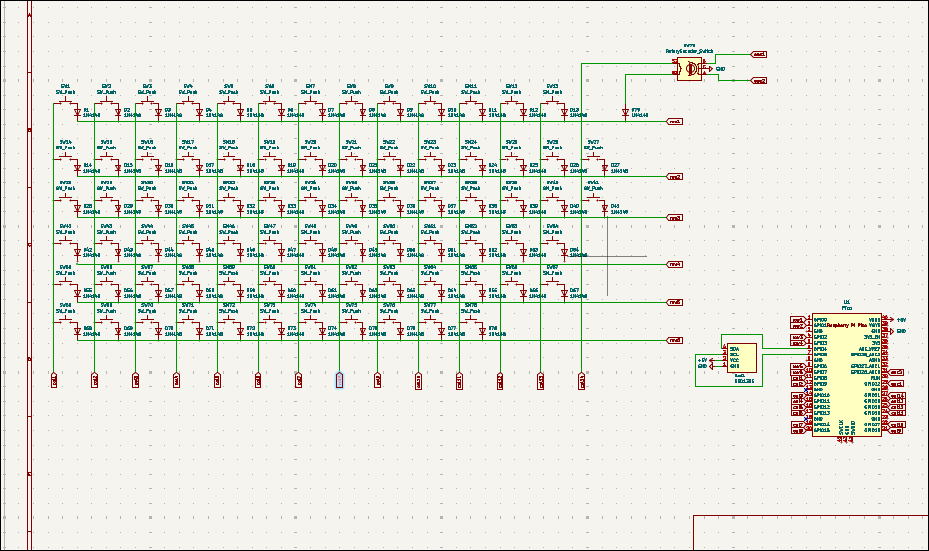
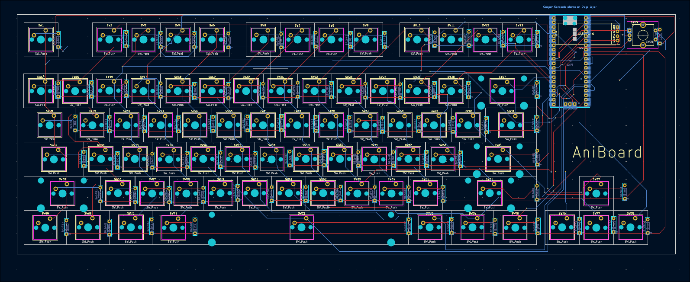
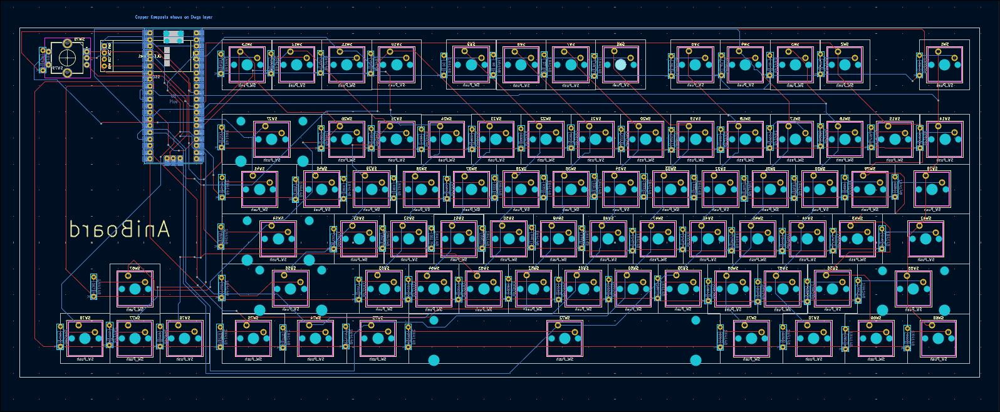
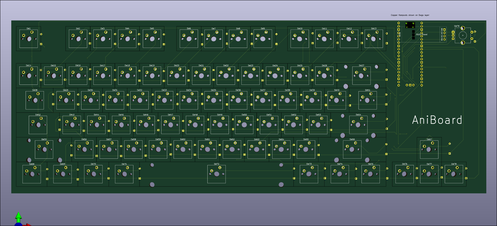
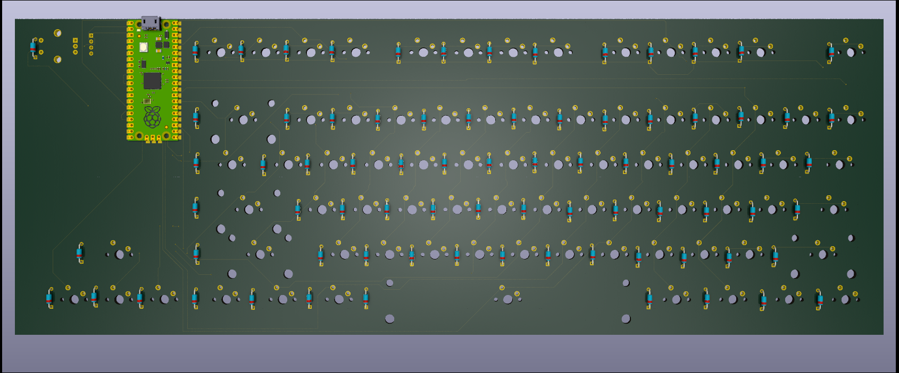
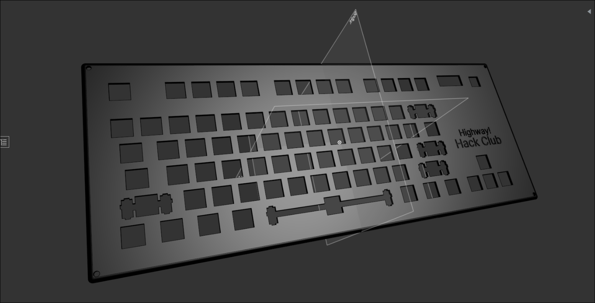
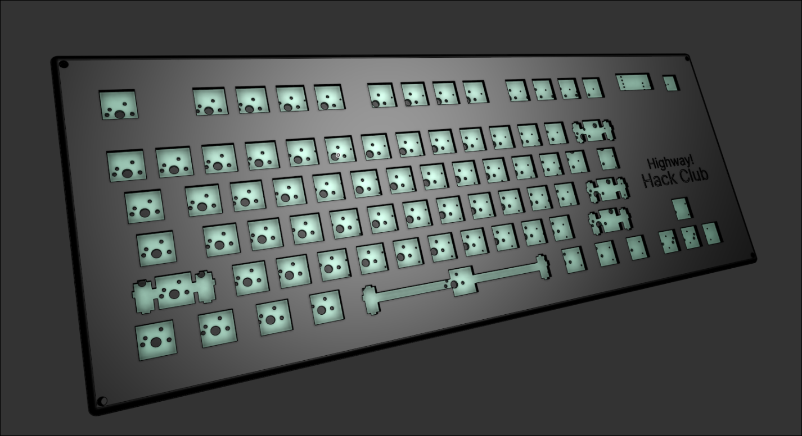
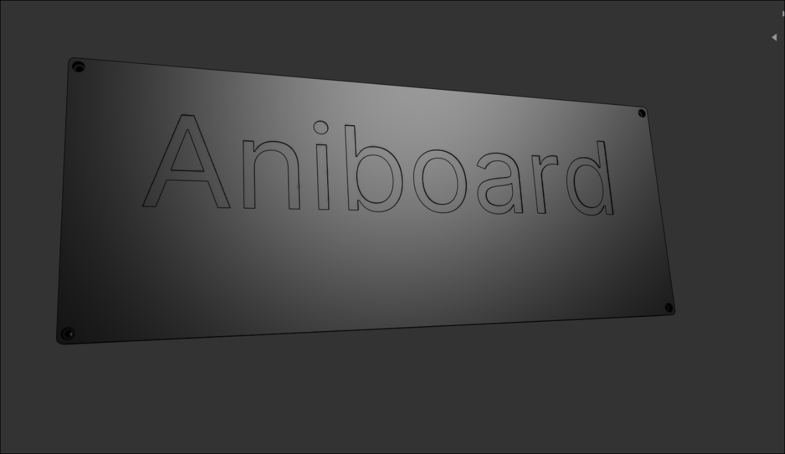
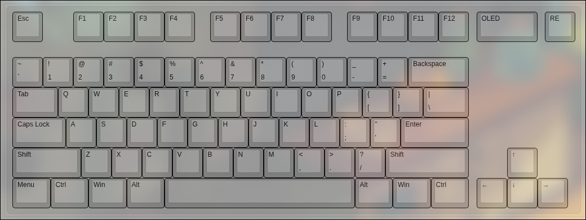

# Anay's Keyboard - Aniboard

Made by Anay

Features:

- EC11 Rotary Encoder - For Volume, Brightness etc
- TKL Layout minus (9 keys above the arrow keys)
- 0.91" OLED for Pictures, Current Playing Media etc.
- 78x keys
- Highway & Hack Club Branded Case
- Raspberry Pico
- Personalised layout
- KMK firmware

## Info

I made this keyboard since I wanted a keyboard with the Function keys and I use use two displays so it is not actually possible to use my laptop's keyboard all the time, I made this keyboard.

I think this i s perfect keyboard for me as it has a RE and a OLED display, which can help for like increasing hte volume or decreasing, and the display can help me with the things like the spotify stuff.

Oh and it also looks very nice in my eyes. Took me more than **40 hours** making the PCB, Case and researching for the BOM. I was really so much fun to make it.

## PCB

The PCB's size is 360.4mm x 130.4mm

| Schematic                     |
| ----------------------------- |
|  |

| Front                     |
| ------------------------- |
|  |

| Back                     |
| ------------------------ |
|  |

| 3D - Front                   |
| ---------------------------- |
|  |

| 3D - Back                   |
| --------------------------- |
|  |

## Case

  
  
  
  

I have made this case in Onshape.

there are two two parts for the case one is the top and another is the top.

# Top:

# Bottom:

## 3D Render:

## Layout:

The Layout is a TKL (Tenkey-less) layout with some features like RE and OLED.

- removing Home, End etc island
- removing PrtSc etc island
- moving Fn key to bottom-left

## BOM

| Name                                                          | Qty | Final Price - INR (USD) | Link                                                                                                                        |
| ------------------------------------------------------------- | --- | ----------------------- | ----------------------------------------------------------------------------------------------------------                  |
| Gateron EF Grayish                                            | 80  | 1560 ($18.19)           | [here](https://neomacro.in/products/gateron-ef-grayish)                                                                     |
| Durock Smokey Screw-In Stabilizers V2 (4+1 w/ 6.25u spacebar) | 1   | 1299 ($15.14)           | [here](https://stackskb.com/store/durock-smokey-screw-in-stabilizers-v2/)                                                   |
| Cherry Profile PBT Keycaps                                    | 1   | 1595 ($18.6)            | [here](https://stackskb.com/store/veekos-gradient-keycaps-cherry-profile-135-keys)                                          |
| Diode 1N4148 Through - Hole                                   | 100 | 169 ($1.97)             | [here](https://amzn.in/d/j3eLvoh)                                                                                           |
| 0.91" OLED SSD1306                                            | 1   | 166 ($1.92)             | [here](https://amzn.in/d/3cISYEV)                                                                                           |
| EC11 Rotary Encoder                                           | 2   | 178 ($2.08)             | [here](https://amzn.in/d/hVRxzij)                                                                                           |
| M3 x 20mm Bolt                                                | 15  | 149 ($1.73)             | [here](https://amzn.in/d/8GRQWAB)                                                                                           |
| M3 Nuts                                                       | 8   | 100 ($1.16)             | [here](https://amzn.in/d/7UQtsm8)                                                                                           |
| M3 x 5mm Heatset Insert                                       | 25  | 179 ($2.09)             | [here](https://amzn.in/d/ixybuAc)                                                                                           |
| PCB - (Black Color)                                           | 5   | 4,923.83 ($56.87)       | [here](https://hc-cdn.hel1.your-objectstorage.com/s/v3/74e4c45af47010a7cc1c4b92517cf708e2c89ca2_swappy-20250622-232946.png) |
| Raspberry Pi Pico                                             | 1   | 449 ($5.19)             | [here](http://amazon.in/Raspberry-Pi-Headers-Soldered-Micro/dp/B08WPNM7JB/ref=sr_1_2?sr=8-2)                                |
| Soldering Iron                                                | 1   | 450 ($5.20)             | [here](https://www.amazon.in/INDITRUST-Soldering-adjustable-Temperature-Controlled/dp/B0DP7GJ5YK/ref=sr_1_9?sr=8-9)         |
| Top Case - 1 (Black "./production/CAD/top.step")              | 1   | Print Legion            |
| Bottom Case - 2 (Black "./production/CAD/bottom.step")        | 1   | Print Legion            |

## Total Pricing

The keyboard comes out to be 11217.83 INR ($129.23) When ordering all the parts I'm not including  the 3D parts because I will be getting them from Print Legion.

## Notes :-

I want all the two 3D-printed parts to be printed in black color. that includes: top.step, bottom.step .

The pricing might slightly vary due to flash sales, and dollar market trends.
